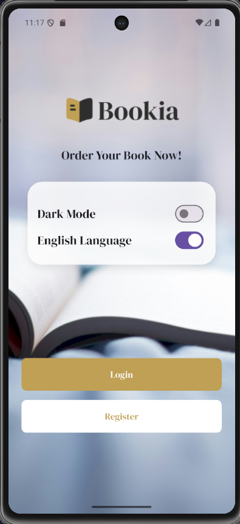
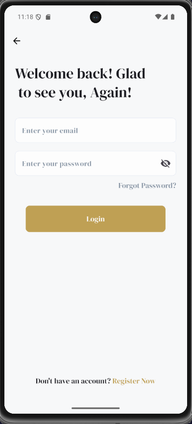
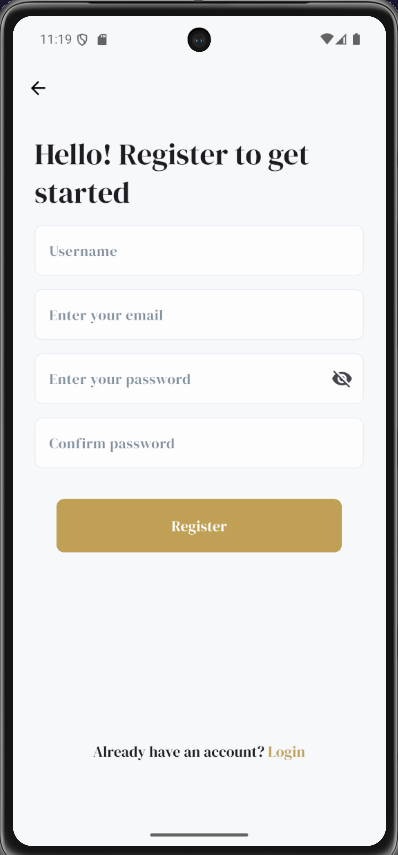
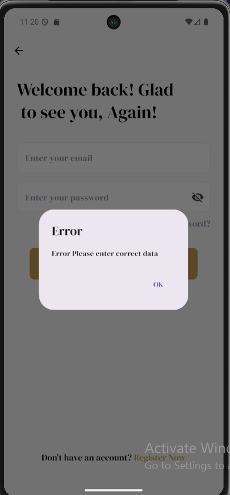
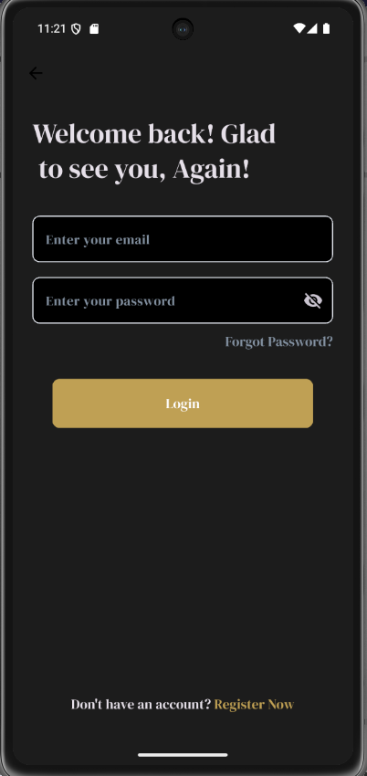
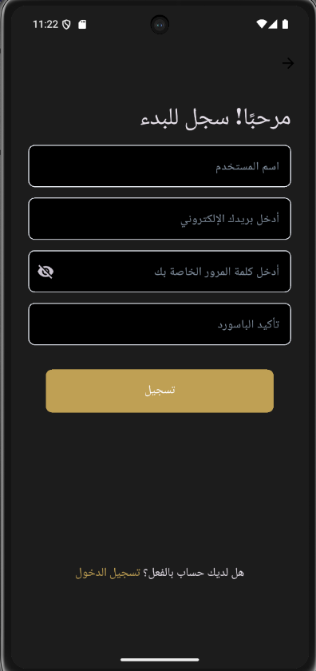

# 📚 Bookia

Bookia is a Flutter application featuring a clean onboarding flow (Welcome → Login → Register), light/dark theming, and full Arabic/English localization, built on top of the BLoC state management pattern.

## 📸 Screenshots

| Welcome                                     | Login                                   | Register                                      | Not Found                                |
| ------------------------------------------- | --------------------------------------- | --------------------------------------------- | ---------------------------------------- |
|  |  |  |  |

| Dark Mode                           | Arabic (RTL)                                    |
| ----------------------------------- | ----------------------------------------------- |
|  |  |

> Add the screenshot images above into a `screenshots/` folder at the project root using the file names referenced in the table.

## ✨ Features

- **Onboarding / Welcome screen** with quick access to Login and Register.
- **Login & Register screens** with custom form fields and validation-ready inputs.
- **Login API integration** via Dio (`POST /api/login`) with request/response logging.
- **Light / Dark theme toggle** powered by `ThemeCubit` (BLoC).
- **Arabic & English localization** with a language switch (RTL supported) via `easy_localization`.
- **Responsive UI** across device sizes using `flutter_screenutil`.
- **Custom native splash screen** configuration.
- **Named route navigation** with a centralized `AppRouter` and a dedicated 404 / Page Not Found screen.

## 🛠 Tech Stack & Packages

### Dependencies

| Package                                                                 | Version | Purpose                                                             |
| ----------------------------------------------------------------------- | ------- | ------------------------------------------------------------------- |
| [flutter_bloc](https://pub.dev/packages/flutter_bloc)                   | ^9.1.1  | State management (Cubit/BLoC) for UI                                |
| [bloc](https://pub.dev/packages/bloc)                                   | ^9.0.1  | Core BLoC library used by `flutter_bloc`                            |
| [dio](https://pub.dev/packages/dio)                                     | ^5.11.0 | HTTP client used for API requests (e.g. login)                      |
| [http](https://pub.dev/packages/http)                                   | ^1.6.0  | Lightweight HTTP client                                             |
| [pretty_dio_logger](https://pub.dev/packages/pretty_dio_logger)         | ^1.4.0  | Readable request/response logging for Dio in debug mode             |
| [easy_localization](https://pub.dev/packages/easy_localization)         | ^3.0.8  | App localization (English / Arabic) with `.tr()` and generated keys |
| [flutter_screenutil](https://pub.dev/packages/flutter_screenutil)       | ^5.9.3  | Responsive sizing/scaling (`.w`, `.h`, `.r`, `.sp`) across devices  |
| [flutter_native_splash](https://pub.dev/packages/flutter_native_splash) | ^2.4.7  | Native splash screen generation for Android/iOS                     |
| [flutter_gen](https://pub.dev/packages/flutter_gen)                     | ^5.15.0 | Type-safe generated references to assets/fonts (`lib/gen`)          |
| [cupertino_icons](https://pub.dev/packages/cupertino_icons)             | ^1.0.8  | iOS-style icon set                                                  |

### Dev Dependencies

| Package                                                           | Version | Purpose                                                          |
| ----------------------------------------------------------------- | ------- | ---------------------------------------------------------------- |
| [build_runner](https://pub.dev/packages/build_runner)             | ^2.12.0 | Code generation runner (used by `flutter_gen_runner`)            |
| [flutter_gen_runner](https://pub.dev/packages/flutter_gen_runner) | latest  | Generates `lib/gen/assets.gen.dart` and `lib/gen/fonts.gen.dart` |
| [flutter_lints](https://pub.dev/packages/flutter_lints)           | ^6.0.0  | Recommended lint rules                                           |
| [flutter_test](https://docs.flutter.dev/testing)                  | sdk     | Flutter's testing framework                                      |

## 🏗 Project Structure

```
lib/
├── main.dart                     # App entry point (EasyLocalization + ThemeCubit setup)
├── bookia_app.dart                # MaterialApp, ScreenUtilInit, routing & theming wiring
├── core/
│   ├── helper/                   # Extensions & dialog helpers
│   ├── routes/                   # Route names (Routes) & AppRouter (onGenerateRoute)
│   ├── theme/                    # AppColors, AppTheme, ThemeCubit (light/dark)
│   └── widgets/                  # Shared widgets (buttons, form fields, back button)
├── features/
│   ├── welcome/                  # Welcome/onboarding screen + settings widget
│   ├── login/                    # Login page + Dio-based LoginRepo
│   ├── register/                 # Register screen + LoginCubit/LoginState
│   └── notfound/                 # 404 / Page Not Found screen
└── gen/                          # Auto-generated assets, fonts & locale keys
```

## 🌍 Localization

Supported locales: **English (en)** and **Arabic (ar)**, defined in `assets/translations/en.json` and `assets/translations/ar.json`. Users can switch languages at runtime from the Welcome screen settings panel.

## 🎨 Theming

Light and dark themes are defined in `AppColors` / `AppTheme` and toggled at runtime via `ThemeCubit`, also switchable from the Welcome screen settings panel.

## 🚀 Getting Started

### Prerequisites

- [Flutter SDK](https://docs.flutter.dev/get-started/install) (Dart ^3.10.7)
- An emulator/device or a supported desktop/web target

### Installation

```bash
git clone <repository-url>
cd bookia
flutter pub get
```

### Run the app

```bash
flutter run
```

### Important commands

Generate asset/font references (`flutter_gen`) after adding new assets:

```bash
dart run build_runner build --delete-conflicting-outputs
```

Generate localization keys after editing translation files:

```bash
dart run easy_localization:generate --source-dir ./assets/translations -f keys -o locale_keys.g.dart -O lib/gen
```

## 📄 License

This project is a starting point for a Flutter application and has no explicit license set.
